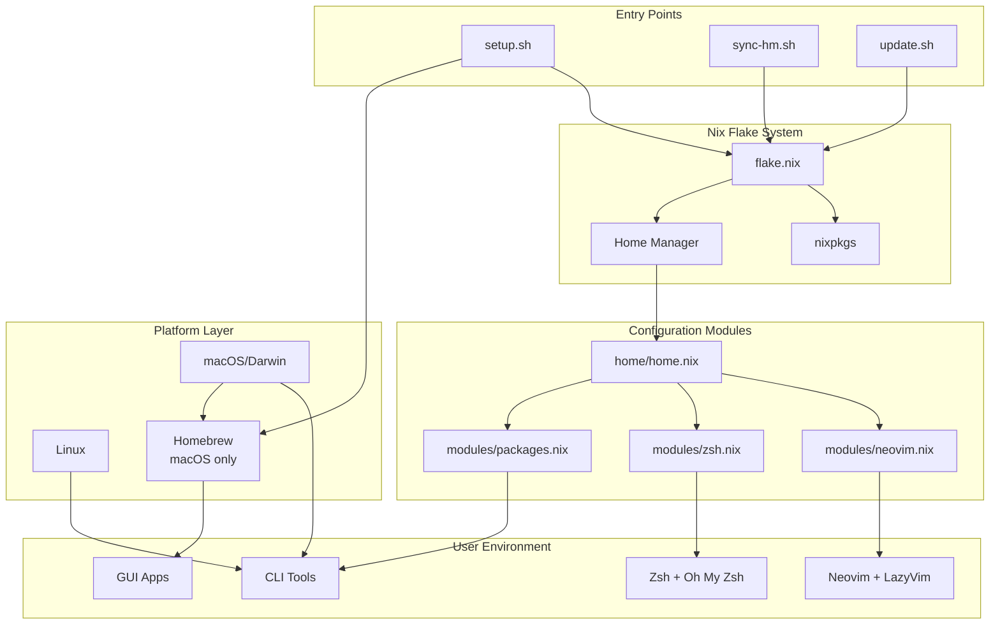
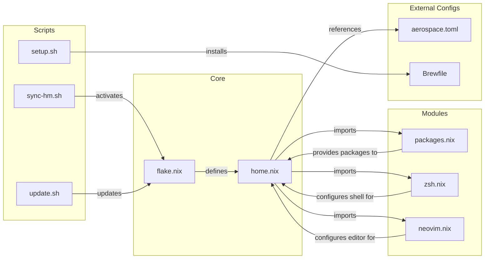
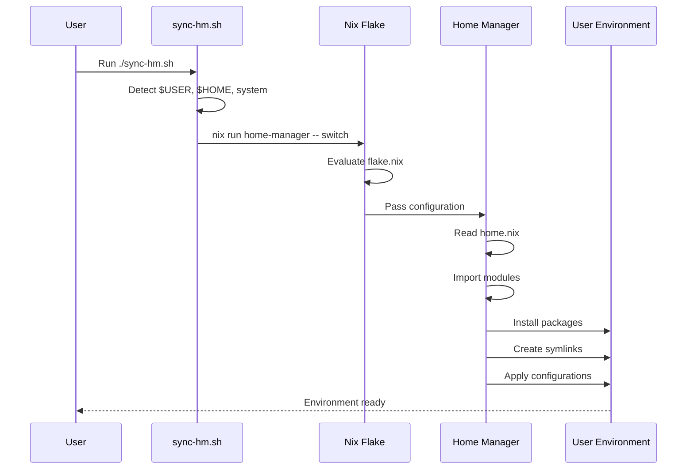
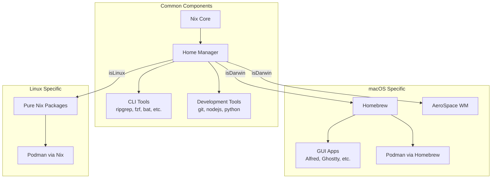

# Rico's Development Environment

[](https://github.com/Ricoledan/nix-config/actions/workflows/ci.yml)
[](https://github.com/Ricoledan/nix-config/actions/workflows/ci-simple.yml)
[](https://github.com/Ricoledan/nix-config/actions/workflows/update-deps.yml)
[](https://nixos.wiki/wiki/Flakes)
[](https://github.com/nix-community/home-manager)

Cross-platform Nix flake configuration with Home Manager integration, following best practices for
maintainability and security.

## Core Principles

1. **Reproducibility First**: Prefer declarative, reproducible configurations over imperative setups
   - Use Nix for package management when possible
   - Version-control all configuration
   - Minimize manual setup steps

2. **Cross-Platform Compatibility**: Support both macOS and Linux seamlessly
   - Use conditional logic for platform-specific needs
   - Document platform differences clearly
   - Test on both platforms regularly

3. **Pragmatic Over Pure**: Choose practical solutions when ideal ones are too complex
   - It's okay to use platform-native tools (like Homebrew) when Nix falls short
   - Prioritize working solutions over theoretical purity
   - Document and justify exceptions clearly (see [DECISIONS.md](DECISIONS.md))

4. **User Experience**: Make the setup process as smooth as possible
   - Provide clear error messages and guidance
   - Automate what can be automated
   - Document manual steps thoroughly

5. **Maintainability**: Keep the configuration simple and well-documented
   - Prefer clarity over cleverness
   - Document the "why" not just the "what"
   - Regular cleanup of unused components

## Features

- **Cross-platform**: Works seamlessly on macOS (aarch64) and Linux (x86_64)
- **Declarative**: All configuration in code, fully reproducible
- **Automated**: Multiple CI/CD workflows, automated dependency updates, format checking
- **Secure**: Built-in secret management guidelines, security scanning (when available)
- **Fast**: Optimized with Nix caches and direnv integration
- **Pragmatic**: Uses platform-native tools when optimal (see [DECISIONS.md](DECISIONS.md))
- **Well-documented**: Comprehensive guides for modules, workflows, and troubleshooting

## Documentation

- **[Module Documentation](docs/modules.md)** - Detailed information about each module
- **[Common Workflows](docs/workflows.md)** - Day-to-day usage and tasks
- **[Troubleshooting Guide](docs/troubleshooting.md)** - Solutions to common issues
- **[Architectural Decisions](DECISIONS.md)** - Rationale behind design choices

## Quick Start

### Prerequisites

- Nix installed (with flakes enabled)
- Git installed

### Initial Setup on a New Machine

```bash
# 1. Clone this repository
git clone https://github.com/ricoledan/nix-config.git
cd nix-config

# 2. Run initial setup (installs Homebrew on macOS)
./setup.sh

# 3. Apply the configuration (works for any user)
./sync-hm.sh

# The sync-hm.sh script automatically:
# - Detects your username ($USER)
# - Detects your home directory ($HOME)
# - Detects your system architecture
# - Applies the configuration

# For manual runs, use:
# nix run home-manager/master -- switch --flake .#user@$(nix eval --impure \
#   --expr 'builtins.currentSystem' --raw) --impure

# 4. Enter development shell (optional, for development work)
nix develop

# 5. Allow direnv for automatic environment loading
direnv allow
```

### What This Does

1. **setup.sh**: Installs Homebrew (macOS only) and ensures Nix flakes are enabled
2. **Home Manager activation**:
   - Installs all packages defined in `home/modules/packages.nix`
   - Configures Zsh with Oh My Zsh and Powerlevel10k (with instant prompt)
   - Sets up Neovim with LazyVim
   - Applies all dotfiles and configurations
   - Enables direnv for automatic environment loading
3. **nix develop**: Provides a minimal shell (git, nixpkgs-fmt) before Home Manager activation

## Components Overview

### Core Technologies

- **Nix Flakes**: Reproducible, declarative package management
- **Home Manager**: User environment and dotfile management
- **Homebrew** (macOS): GUI applications and system packages
- **Oh My Zsh + Powerlevel10k**: Enhanced terminal experience
- **Direnv**: Automatic environment loading

### Development Tools (via Nix)

- **Editors**: VSCode, Neovim
- **Version Control**: Git, GitHub CLI (gh)
- **Containers**: Managed via Homebrew on macOS (see [docs/podman.md](docs/podman.md))
- **Languages**: Node.js 22, Python 3 (with pip)
- **Code Quality**: pre-commit, nixpkgs-fmt
- **CLI Tools**:
  - Text processing: jq, ripgrep, bat, fd
  - System utilities: curl, tree, openssh
  - Media: yt-dlp
  - AI: claude-code

### Shell Configuration

- **Zsh** with:
  - Oh My Zsh (git, podman plugins)
  - Powerlevel10k theme
  - Syntax highlighting
  - Auto-suggestions
  - Custom aliases (ll, gs, gc, gp)
  - 10k line history
  - Fastfetch on startup

### Editor Configuration

- **Neovim** with:
  - LazyVim distribution (full IDE experience)
  - LSP support for multiple languages
  - Auto-installed plugins via Nix
  - Custom plugin support in `~/.config/nvim/lua/plugins/`

### Window Management

- **Aerospace**: Tiling window manager for macOS
  - Configuration in `config/aerospace.toml`
  - Managed by Home Manager
  - i3-like keybindings

### macOS Applications (via Homebrew)

- **Development**: Ghostty (terminal), Podman Desktop
- **Productivity**: Alfred, Todoist, Fantastical, Notion, Bear, Obsidian
- **Utilities**: 1Password, CleanMyMac, Caffeine, Aerospace (window manager)
- **Media**: Plex, mpv
- **Communication**: Discord
- **Creative**: Adobe Creative Cloud
- **Research**: Zotero
- **Browser**: Zen Browser

## Architecture Diagrams

### System Architecture

This diagram shows the high-level architecture of the Nix configuration system. It illustrates how the
three main entry scripts (`setup.sh`, `sync-hm.sh`, and `update.sh`) interact with the Nix flake system,
which then configures the user environment through Home Manager. The platform layer shows how macOS uses
Homebrew for certain packages while Linux uses pure Nix packages.



### Module Dependencies

This diagram illustrates the relationships between different configuration files and modules. The core
`flake.nix` defines the overall system and references `home.nix`, which then imports various modules for
packages, shell (zsh), and editor (neovim) configuration. External scripts interact with these files to
set up, sync, or update the system.



### Data Flow

This sequence diagram shows the step-by-step process that occurs when you run `./sync-hm.sh`. It
demonstrates how the script detects your user environment, invokes Nix flake evaluation, passes
configuration to Home Manager, and ultimately results in a fully configured user environment with all
packages installed and configurations applied.



### Platform-Specific Components

This diagram clearly separates common components that work across all platforms from platform-specific
implementations. It shows how the configuration handles differences between macOS and Linux, particularly
highlighting that macOS uses Homebrew for GUI applications and Podman, while Linux can use pure Nix
packages for everything. The `isDarwin` and `isLinux` conditions in the configuration determine which
components are activated.



## Automation & Maintenance

### Update Dependencies

```bash
# Run the update script to update all flake inputs
./update.sh
```

This script will:

- Update nixpkgs and home-manager to latest versions
- Show you what changed
- Optionally commit the updates with detailed messages
- Run flake checks to ensure everything works

### Code Quality & Pre-commit Hooks

This repository uses [pre-commit](https://pre-commit.com/) to ensure code quality and consistency.

#### Installed Hooks

- **nixpkgs-fmt**: Automatically formats `.nix` files to the standard style
- **shellcheck**: Lints shell scripts for common errors and best practices
- **trailing-whitespace**: Removes unnecessary whitespace at line endings
- **end-of-file-fixer**: Ensures all files end with a newline
- **check-merge-conflict**: Prevents committing merge conflict markers
- **gitleaks**: Scans for hardcoded secrets and credentials

#### Usage

```bash
# Hooks run automatically on git commit
git commit -m "Your message"

# Run hooks manually on all files
pre-commit run --all-files

# Run a specific hook
pre-commit run nixpkgs-fmt

# Update hook versions
pre-commit autoupdate

# Skip hooks temporarily (not recommended)
git commit --no-verify -m "Emergency fix"
```

### Code Formatting

```bash
# Format all Nix files
nix fmt

# Check formatting without changes
nix fmt -- --check
```

### Run Checks

```bash
# Run all flake checks
nix flake check

# Show flake metadata
nix flake metadata
```

## Common Workflows

### Daily Development

```bash
# Start your day - enter the development environment
nix develop

# Your shell will have all tools available
# Fastfetch runs automatically on first shell
```

### Making Configuration Changes

```bash
# Edit configuration files
vim home/home.nix              # Home Manager config
vim home/modules/packages.nix  # Nix packages
vim home/modules/zsh.nix       # Shell config
vim Brewfile                   # macOS apps

# Apply changes
./sync-hm.sh

# For Brewfile changes
brew bundle
```

### Checking Home Manager News

```bash
# View Home Manager news (updates, breaking changes, new features)
home-manager news --flake ".#user@aarch64-darwin" --impure

# For Linux:
home-manager news --flake ".#user@x86_64-linux" --impure
```

### Updating Packages

```bash
# Update all Nix packages (recommended method)
./update.sh

# Or manually:
nix flake update
./sync-hm.sh

# Update Homebrew packages
brew update && brew upgrade
brew bundle  # Ensure Brewfile apps are installed
```

### Adding New Tools

```bash
# For CLI tools (cross-platform)
# Edit flake.nix or home/modules/packages.nix
# Add package name to the list

# For macOS GUI apps
# Edit Brewfile
# Add: cask "app-name"
# Run: brew bundle
```

## File Structure

```text
.
├── flake.nix                 # Main Nix configuration with formatter & checks
├── flake.lock               # Locked dependencies
├── home/
│   ├── home.nix            # Home Manager entry point
│   ├── modules/
│   │   ├── packages.nix    # Nix packages for home
│   │   ├── zsh.nix        # Shell configuration with P10k
│   │   └── neovim.nix     # Neovim config with LazyVim
│   └── systems/
│       └── default.nix    # System-specific configurations
├── dotfiles/
│   └── .p10k.zsh          # Powerlevel10k config
├── config/
│   └── aerospace.toml    # Aerospace window manager config
├── docs/
│   └── podman.md         # Podman setup documentation
├── .github/
│   └── workflows/
│       └── check.yml      # CI/CD checks
├── Brewfile               # macOS applications
├── .pre-commit-config.yaml # Pre-commit hooks configuration
├── setup.sh              # Initial setup script
├── sync-hm.sh            # Sync Home Manager configuration
├── update.sh             # Update automation script
├── .envrc                # Direnv configuration
├── .gitignore            # Includes .env for secrets
├── DECISIONS.md          # Architectural decisions log
├── CLAUDE.md            # Claude AI context file
└── README.md            # This file
```

## Troubleshooting

### Home Manager Not Found

```bash
# Run the sync script:
./sync-hm.sh
```

### LazyVim Not Working

```bash
# Clear Neovim cache and plugins
rm -rf ~/.local/share/nvim
rm -rf ~/.cache/nvim
rm -rf ~/.config/nvim/lazy-lock.json

# Rebuild Home Manager configuration
./sync-hm.sh

# Launch Neovim - LazyVim will auto-install
nvim
```

### Zsh/P10k Issues

```bash
# To modify p10k configuration:
# Edit dotfiles/.p10k.zsh directly
# Then rebuild: ./sync-hm.sh
```

### Nix Build Failures

```bash
# Clear Nix store and rebuild
nix-collect-garbage -d
nix flake update
./sync-hm.sh
```

### Environment Not Loading

```bash
# Ensure direnv is allowed
direnv allow

# Manually reload
nix develop
```

### Podman Issues on macOS

Podman is managed via Homebrew on macOS. See [docs/podman.md](docs/podman.md) for setup instructions.

## Security Best Practices

### Secret Management

- **Never commit secrets** to this repository
- Use environment variables for API keys and tokens
- Store secrets in 1Password and use the CLI integration (already configured)
- For persistent secrets, consider:
  - `.env` files (git-ignored)
  - macOS Keychain
  - 1Password CLI: `op read "op://vault/item/field"`

### Flake Configuration Trust

When first using this flake, you'll be prompted to trust the cache configuration. Accept with:

```bash
nix flake metadata --accept-flake-config
```

### Missing Commands

```bash
# Check if in Nix shell
which <command>

# If not found, ensure you're in nix develop
exit
nix develop
```

## Platform-Specific Notes

### macOS

- Homebrew handles GUI applications
- System Integrity Protection may affect some tools
- Use `mas` for Mac App Store apps

### Linux

- GUI apps would use apt/snap/flatpak
- Home directory is automatically detected
- Some macOS-specific tools won't be available

### Multi-User/Multi-System Support

- Configuration automatically detects:
  - Current username via `$USER` environment variable
  - Home directory via `$HOME` environment variable
  - System architecture (aarch64-darwin, x86_64-linux)
- No need to edit configuration files when switching between machines
- Works seamlessly across different usernames and home directory locations
- Just run `./sync-hm.sh` on any machine

## CI/CD Integration

This repository includes GitHub Actions workflows that:

- Run on every push to `main` and on pull requests
- Check flake validity across macOS and Linux
- Verify code formatting
- Build the development shell for both platforms

The CI uses [Determinate Systems' Nix actions](https://github.com/DeterminateSystems) for optimal performance.
